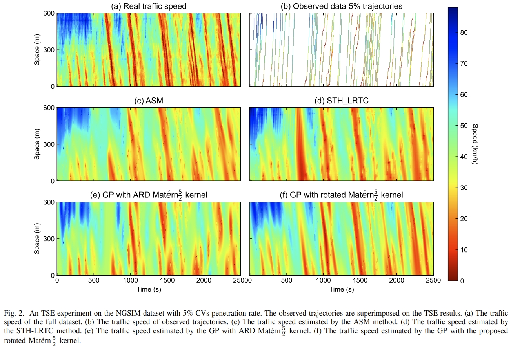

# GP_TSE
The code and data for the paper:
- Wu, F., Cheng, Z., Chen, H., Qiu, T. Z., & Sun, L. (2023). [Traffic state estimation from vehicle trajectories with anisotropic gaussian processes] \textit{Transportation Research Part C: Emerging Technologies, 163, 104646} DOI: 10.1016/j.trc.2024.104646. 
- Wu, F., Cheng, Z., Chen, H., Qiu, T. Z., & Sun, L. (2023). [Traffic State Estimation with Anisotropic Gaussian Processes from Vehicle Trajectories](https://arxiv.org/abs/2303.02311). arXiv preprint arXiv:2303.02311.

## Requirements
- GPflow >= 2.0.0
- tensorflow >= 2.0.0
- tensorflow_probability
- Other packages: numpy, scipy, matplotlib
- Some baseline models, adaptive smoothing interpolation (ASM) and Spatiotemporal Hankel Low-Rank Tensor Completion (STH-LRTC) are implemented in MATLAB.

## Data
The data used in the paper is available at [data](data//), the data in `mat` and `npy` formats have the same values.

## Getting Started
- See [demo.ipynb](demo.ipynb) for a quick start.
- The experiments in the paper can be reproduced by running the scripts in [experiments](experiments//). Note there could be some errors about the path of the data, please modify the path in the scripts to the correct path of the data.

